<div align="center">
  <!-- 1. Animated Hero Banner -->
  

  <br/><br/>

  <!-- Sleek Badge Shields -->
  <a href="https://github.com/Ayush-840">
    
  </a>
  <a href="https://www.linkedin.com/in/ayush-singh-219aba379">
    
  </a>
  <a href="mailto:singhayushkumar5555@gmail.com">
    
  </a>

  <br/><br/>

  <!-- Dynamic Typing Animation -->
  <a href="https://github.com/Ayush-840">
    
  </a>
</div>

<br/>

---

### 🚀 Professional Bio

I am an **AI Engineer & Full-Stack Developer** focused on engineering **scalable web applications**, architecting intelligent **RAG pipelines**, and mastering **advanced DSA**.

🎓 **Education**: Pursuing **B.Tech in CS (AI & ML)** at **Newton School of Technology** *(in collaboration with D.Y. Patil University)*.

> *"Building intelligent software one commit at a time."*

---

### ⚡ Quick Overview

```javascript
const engineer = {
  name: "Ayush Singh",
  title: "AI Engineer & Full-Stack Developer",
  education: "B.Tech CS (AI & ML) @ Newton School of Tech (DY Patil)",
  location: "Pune / Patna, India 🇮🇳",
  currentStatus: [
    "Building",
    "Learning",
    "Shipping"
  ],
  coreFocus: [
    "Scalable Web Apps",
    "RAG Pipelines",
    "Advanced DSA"
  ],
  contact: {
    email: "singhayushkumar5555@gmail.com",
    github: "https://github.com/Ayush-840",
    linkedin: "https://www.linkedin.com/in/ayush-singh-219aba379"
  }
};
```

---

### 💻 Tech Stack

<table width="100%">
  <thead>
    <tr>
      <th width="25%" align="center">⚡ Languages</th>
      <th width="25%" align="center">🎨 Frontend</th>
      <th width="25%" align="center">⚙️ Backend &amp; DB</th>
      <th width="25%" align="center">🤖 AI &amp; Tools</th>
    </tr>
  </thead>
  <tbody>
    <tr>
      <td align="center" valign="top">
        <br/><br/>
        <br/><br/>
        <br/><br/>
        
      </td>
      <td align="center" valign="top">
        <br/><br/>
        <br/><br/>
        <br/><br/>
        
      </td>
      <td align="center" valign="top">
        <br/><br/>
        <br/><br/>
        <br/><br/>
        
      </td>
      <td align="center" valign="top">
        <br/><br/>
        <br/><br/>
        <br/><br/>
        <br/><br/>
        
      </td>
    </tr>
  </tbody>
</table>

---

### 🎯 Current Focus & Mastery Roadmap

- 🧠 **Advanced DSA**: Mastering graph algorithms, dynamic programming optimizations, and high-frequency competitive coding.
- 🤖 **Machine Learning & RAG**: Building specialized retrieval-augmented generation pipelines, fine-tuning LLMs, and agentic workflows.
- 🏗️ **System Design**: Deep-diving into microservice architectures, caching strategies, distributed consensus, and API gateway patterns.
- ⚡ **Backend Engineering**: Designing low-latency REST APIs, asynchronous task processing, and database query optimization.
- 🌐 **Open Source**: Actively contributing to high-impact developer tooling and open-source AI frameworks.

---

### 📊 GitHub Statistics

<div align="center">

| **GitHub Overview** | **Top Languages** |
| :---: | :---: |
|  |  |

<br/>


</div>

---

### 🐍 Contribution Activity Matrix

<div align="center">
  <picture>
    <source media="(prefers-color-scheme: dark)" srcset="https://raw.githubusercontent.com/Ayush-840/Ayush-840/main/assets/github-contribution-grid-snake-dark.svg" />
    <source media="(prefers-color-scheme: light)" srcset="https://raw.githubusercontent.com/Ayush-840/Ayush-840/main/assets/github-contribution-grid-snake.svg" />
    
  </picture>
</div>

<br/>

---

### 🏆 Achievements & Trophies

<div align="center">
  
</div>

<br/>

---

### 📌 Featured Projects

<table width="100%">
  <tr>
    <td width="50%" valign="top" align="center">
      <h3>🤖 Intelligent RAG &amp; AI Agent Platform</h3>
      <p align="left">
        Production-grade retrieval-augmented generation engine designed for seamless document querying, semantic vector search, and dynamic agentic workflows.
      </p>
      <p align="left">
        <b>Tech Stack:</b> <code>Python</code> • <code>HuggingFace</code> • <code>RAG</code> • <code>Vector DB</code> • <code>FastAPI</code>
      </p>
      <br/>
      <a href="https://github.com/Ayush-840" target="_blank">
        
      </a>
      &nbsp;
      <a href="https://github.com/Ayush-840" target="_blank">
        
      </a>
    </td>
    <td width="50%" valign="top" align="center">
      <h3>⚡ High-Performance Full-Stack Dashboard</h3>
      <p align="left">
        Modern developer analytics and workflow automation dashboard featuring real-time data streaming, dynamic dark-mode glassmorphism UI, and optimized REST APIs.
      </p>
      <p align="left">
        <b>Tech Stack:</b> <code>React</code> • <code>Node.js</code> • <code>Express</code> • <code>MongoDB</code> • <code>Tailwind</code>
      </p>
      <br/>
      <a href="https://github.com/Ayush-840" target="_blank">
        
      </a>
      &nbsp;
      <a href="https://github.com/Ayush-840" target="_blank">
        
      </a>
    </td>
  </tr>
</table>

---

### 📈 Skill Proficiency Dashboard

<div align="center">

```text
Advanced DSA           [████████████████████░░░░] 85%
AI & ML / RAG          [███████████████████░░░░░] 82%
Full-Stack Web         [█████████████████████░░░] 88%
System Design          [█████████████████░░░░░░░] 74%
DevOps & Cloud         [███████████████░░░░░░░░░] 68%
```

</div>

---

### 🌐 Coding Profiles & Professional Links

<div align="center">

<a href="https://github.com/Ayush-840">
  
</a>
<a href="https://leetcode.com/u/ayusher999/">
  
</a>
<a href="https://codeforces.com/profile/singhayushkumar55550">
  
</a>
<a href="https://www.linkedin.com/in/ayush-singh-219aba379">
  
</a>

</div>

---

### 📫 Contact & Connect

```bash
$ ayush --contact
--------------------------------------------------------------
 Email    : singhayushkumar5555@gmail.com
 Location : Patna, Bihar, India 🇮🇳
 Status   : Open for AI & Full-Stack Engineering roles
--------------------------------------------------------------
```

<div align="center">
  <sub>Handcrafted with precision for <b>Ayush Singh</b> • Dark Glassmorphic Aesthetic</sub>
</div>
